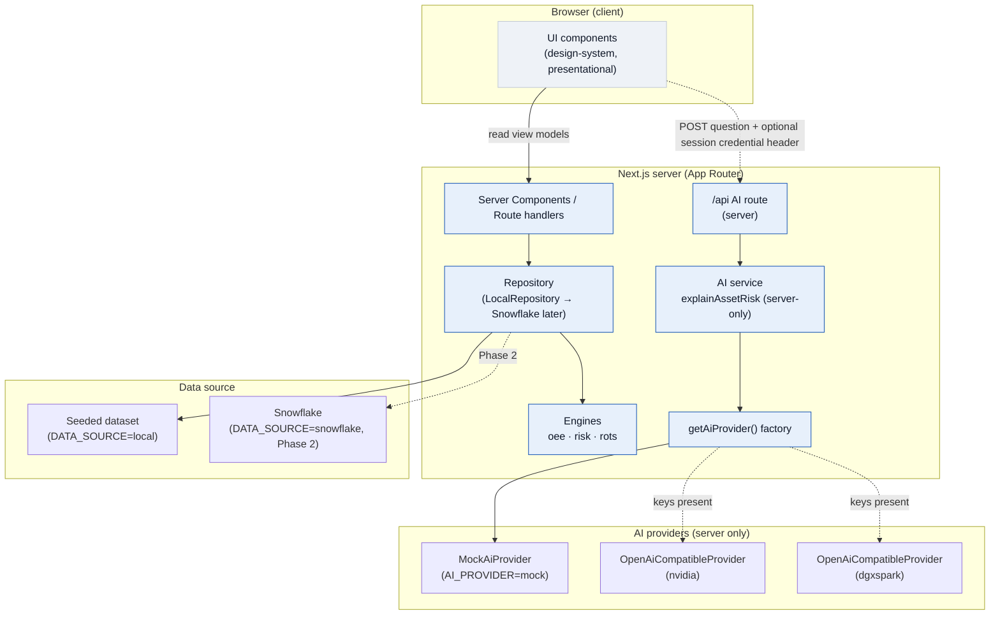

# Asset Supervision OS — Architecture

> **Physical Operations Intelligence platform.** All data referenced here is
> **synthetic demonstration data**. No proprietary, confidential, or real
> company data is used anywhere in this product.

This document describes the system architecture *as implemented*: the layering,
the provider-neutral AI design, the determinism strategy, the local-vs-Snowflake
data-source strategy, and the security posture. Formulas live in
[`METRIC_DEFINITIONS.md`](./METRIC_DEFINITIONS.md); entities live in
[`DATA_DICTIONARY.md`](./DATA_DICTIONARY.md).

---

## 1. Design principles

1. **Evidence before inference.** Every value shown to a user is attributable to
   a `Provenance` (`measured | deterministic | business_rule | statistical |
   ai_generated | human`). The UI can therefore distinguish measured facts,
   calculations, predictions, model text, and human judgement.
2. **Deterministic where determinism is possible.** OEE, financial exposure,
   risk scoring, and Return-on-Token-Spend are exact calculations. LLMs are used
   only to *explain* pre-computed numbers, never to produce them.
3. **Portable intelligence.** The AI layer is provider-neutral and runs with no
   API key out of the box (offline mock). Swapping to NVIDIA or a DGX
   Spark-hosted endpoint changes environment variables only — no caller changes.
4. **Decision-intelligence layer, not a control system.** The platform observes,
   reasons, explains, and recommends. Humans decide; control systems act. AI is
   never presented as an autonomous action.
5. **Determinism.** A fixed `SEED` and a fixed `ANCHOR_NOW` make the whole
   dataset byte-for-byte reproducible on every run and in every environment.

---

## 2. Technology stack

| Concern | Choice |
|---|---|
| Framework | Next.js 14 (App Router) |
| Language | TypeScript (strict) |
| Styling | Tailwind CSS wired to CSS-variable design tokens |
| Fonts | Geist Sans / Geist Mono |
| Validation | Zod |
| Testing | Vitest |
| AI SDK | None required for mock; `fetch` against OpenAI-compatible endpoints for NVIDIA / DGX Spark |
| Data (Phase 1) | Local seeded, deterministic in-memory dataset |
| Data (Phase 2) | Snowflake (behind the same `Repository` interface) |

---

## 3. Source layout

```
src/
├── domain/            Domain model (no dependencies on other layers)
│   ├── enums.ts       AssetOperationalStatus, EventSeverity, DataFreshness,
│   │                  Criticality (A–E), WorkOrderStatus, Provenance,
│   │                  DecisionType, RecommendedDisposition, ValueStatus, …
│   └── types.ts       Entity interfaces + the `Dataset` shape
│
├── engines/           Pure deterministic calculation (no I/O, no framework)
│   ├── oee.ts         computeOee, aggregateOee, financialExposure
│   ├── risk.ts        computeRisk, linearSlope
│   └── rots.ts        computeRots, estimateModelCost, usageByProvider, MODEL_RATES
│
├── ai/                Provider-neutral AI (server-side only)
│   ├── types.ts       AiProvider interface, approxTokens
│   ├── prompts.ts     Versioned PROMPTS + renderers
│   ├── providers/
│   │   ├── mock.ts               MockAiProvider (offline, deterministic)
│   │   └── openai-compatible.ts  OpenAiCompatibleProvider (NVIDIA + DGX Spark)
│   ├── index.ts       getAiProvider() factory — reads AI_PROVIDER env
│   └── service.ts     `server-only` explainAssetRisk() — the ONLY model caller
│
├── data/              Data layer
│   ├── constants.ts   SEED, ANCHOR_NOW, thresholds, margins, reference exposure
│   ├── generate.ts    buildDataset(seed) — synthetic data generator
│   ├── k201-analysis.ts  analyzeK201() — single shared K-201 analysis
│   ├── seed.ts        getDataset() — memoized dataset
│   └── repository.ts  Repository interface + LocalRepository + getRepository();
│                      view models (CommandCenterModel, Asset360Model,
│                      RotsModel, TurnaroundSummary)
│
├── design-system/     tokens.css — single source of truth for visual primitives
├── lib/               cn, format (deterministic against ANCHOR_NOW), prng
└── app/               Next.js App Router routes + globals.css
```

Dependency direction is strictly one-way: `app → data → engines → domain` and
`app → data → ai (service) → ai (providers)`. `domain` and `engines` depend on
nothing else; they are pure and unit-tested in isolation.

---

## 4. Layer diagram



**Hard rule — never call a model from the UI.** UI components never import a
provider or the AI service. Model calls originate only in
`src/ai/service.ts`, which is marked [`server-only`](../src/ai/service.ts) so it
can never be bundled into a client component. The service selects a provider via
`getAiProvider()` and returns both the explanation text and a fully-formed
`AiInteraction` record for token accounting.

Authenticated V2 users may also select the existing NVIDIA adapter in the
current tab. The credential is held in a closure-backed client memory vault,
survives navigation within the application, and is sent only in a no-store
header to the same-origin model-test or K-201 investigator endpoint. Testing
validates the key but does not connect it. The server validates authentication
and credential size, resolves the governed model against NVIDIA's `/v1/models`
catalog, creates an `OpenAiCompatibleProvider` for that request, and immediately
discards it after the response. The session path uses
`nvidia/nemotron-3.5-lightning-30b-a3b`, with non-streaming chat completions and
thinking disabled. Safe failures expose only status/category, URL origin and
pathname, content type, stage and correlation ID; raw provider bodies are never
returned. There is no server-global credential map, cookie, browser-storage
entry, database record, filesystem write, or environment mutation. Reloading or
closing the tab, signing out, or explicitly disconnecting clears the client
vault.

---

## 5. The K-201 request flow

K-201 is the "hero asset" (a Criticality-A centrifugal compressor) used to
exercise every module end to end. Two distinct flows produce what a user sees.

### 5.1 Deterministic flow (page render — no model involved)

```
Server Component (Asset 360)
  └─ getRepository().getAsset360("K-201")
       └─ LocalRepository.getAsset360
            ├─ analyzeK201({ sensorReadings, productionRuns, downtimeEvents })   [src/data/k201-analysis.ts]
            │    ├─ aggregateOee(recentRuns)            → OEE + loss tree         [engines/oee.ts]
            │    ├─ financialExposure(lossUnits, margin) → exposure USD           [engines/oee.ts]
            │    └─ computeRisk({ channels, criticality, exposure, … })          [engines/risk.ts]
            │         → healthScore, riskScore, severity, recommendedDisposition
            └─ assembles Asset360Model (sensors, events, work orders, spares,
               recommendation, evidence, decision, linked work package)
  └─ renders view model  (all values carry provenance)
```

`analyzeK201` is the **single shared analysis**: both the seed generator (when
it fabricates the recommendation) and the repository (when it renders the page)
call it, so the risk score, OEE, and exposure shown in Asset 360 are guaranteed
to match the seeded recommendation. There is no second, drifting implementation.

### 5.2 AI explanation flow (on demand — the only model call)

```
UI  ──POST evidence+risk──▶  /api AI route (server)
                                └─ explainAssetRisk({ risk, evidence, … })       [ai/service.ts, server-only]
                                     ├─ getActivePrompt("asset_risk_explanation") [ai/prompts.ts, versioned]
                                     ├─ renderAssetRiskPrompt(...)  → system+user (evidence block only)
                                     ├─ request-scoped NVIDIA provider (authenticated BYOK), or
                                     │  getAiProvider()             → environment provider [ai/index.ts]
                                     │     mock | nvidia | dgxspark  (env-driven, fail-safe to mock)
                                     ├─ provider.generate(request)  → text, tokens, latency
                                     └─ estimateModelCost(model, in, out)         [engines/rots.ts]
                                   returns { text, interaction: AiInteraction }
UI  ◀── explanation text + interaction record (for Return-on-Token-Spend) ──
```

The model receives **only** the structured evidence lines. The prompt instructs
it to use ONLY the supplied evidence, never fabricate numbers or thresholds, and
never present the recommendation as an autonomous action — it always requires
human approval. The mock provider composes prose strictly from the evidence and
is byte-for-byte repeatable.

---

## 6. Provider-neutral AI design

The `AiProvider` interface ([`src/ai/types.ts`](../src/ai/types.ts)) is the
single seam:

```ts
interface AiProvider {
  readonly id: AiProviderId;          // "mock" | "nvidia" | "dgxspark"
  readonly model: string;
  isAvailable(): boolean;             // keys present for this environment?
  generate(req: AiGenerationRequest): Promise<AiGenerationResult>;
}
```

| Provider | File | When used | Credentials |
|---|---|---|---|
| `MockAiProvider` | `providers/mock.ts` | Default; offline demo | None |
| NVIDIA | `providers/openai-compatible.ts` | `AI_PROVIDER=nvidia` | `NVIDIA_API_BASE_URL`, `NVIDIA_API_KEY`, `NVIDIA_MODEL` |
| NVIDIA session BYOK | `providers/nvidia-session.ts` | Authenticated V2 user connects for the active page session | Volatile client-memory key; server receives it only per request |
| DGX Spark | `providers/openai-compatible.ts` | `AI_PROVIDER=dgxspark` | `DGXSPARK_API_BASE_URL`, `DGXSPARK_API_KEY`, `DGXSPARK_MODEL` |

**Model portability path:** `mock` → NVIDIA (OpenAI-compatible
`/chat/completions`) → DGX Spark (same OpenAI-compatible shape, different base
URL / key / model). The NVIDIA and DGX Spark providers are the *same* class
(`OpenAiCompatibleProvider`) parameterised differently, so onboarding a new
OpenAI-compatible endpoint is a configuration change, not a code change.

**Fail-safe selection:** `getAiProvider()` reads `AI_PROVIDER`; if `nvidia` or
`dgxspark` is selected but keys are blank, `isAvailable()` returns false and the
factory falls back to `MockAiProvider`. The app therefore always runs, credential
or not. No network call is ever made without an explicit API key.

**Session BYOK precedence:** an authenticated request carrying the internal
NVIDIA session headers receives a transient NVIDIA provider instance for that
request only. The deterministic K-201 response is still built first. Provider
output may replace only the citation-validated narrative fields; provider
timeout, transport failure, malformed JSON, unsupported claims, or citation
failure returns the complete deterministic response with an explicit governed
fallback status.

---

## 7. Determinism strategy

Reproducibility is a first-class requirement (the demo must be identical on
every machine).

- **Fixed seed** — `SEED = 20260727` ([`src/data/constants.ts`](../src/data/constants.ts)).
  `buildDataset(SEED)` uses a seeded PRNG (`src/lib/prng.ts`); `getDataset()`
  memoises the result per process.
- **Fixed clock** — `ANCHOR_NOW = "2026-07-27T00:00:00.000Z"`. All timestamps
  and relative-time formatting (`fmtRelative` in `src/lib/format.ts`) derive from
  this anchor, so there is **no wall-clock dependency**.
- **Deterministic engines** — `oee.ts`, `risk.ts`, and `rots.ts` are pure
  functions of their inputs. Rounding is deferred to the display layer; engines
  retain full precision (e.g. `rawPerformance` is preserved uncapped for
  data-quality checks).
- **Deterministic mock AI** — the mock provider's text, token counts, and
  (synthetic) latency are functions of the request only.
- **Verification** — `npm run seed:verify` (`scripts/verify-seed.ts`) and the
  Vitest suites (`*.test.ts` beside each engine and `k201-analysis.test.ts`)
  pin the numbers.

---

## 8. Data-source strategy: local now, Snowflake later

Selection is by environment variable `DATA_SOURCE=local|snowflake`. Local
requires no credentials.

- **Phase 1 (implemented): `LocalRepository`.** Implements the `Repository`
  interface over the seeded in-memory `Dataset`. `getRepository()` returns a
  memoised instance. This is the fallback that lets the UI run before any
  Snowflake credentials exist.
- **Phase 2 (planned): Snowflake-backed repository.** Implement the *same*
  `Repository` interface against Snowflake. Because callers depend only on the
  interface and its view models (`CommandCenterModel`, `Asset360Model`,
  `RotsModel`, `TurnaroundSummary`), no UI or engine code changes. The engines
  continue to run on rows the repository fetches. SQL is authored
  Snowflake-compatible; a Python high-volume synthetic generator seeds the
  warehouse (see [`IMPLEMENTATION_PLAN.md`](./IMPLEMENTATION_PLAN.md)).

```ts
// The seam both implementations satisfy (src/data/repository.ts)
interface Repository {
  listAssets(): Asset[];
  getAssetByTag(tag: string): Asset | null;
  getCommandCenter(): CommandCenterModel;
  getAsset360(tag: string): Asset360Model | null;
  getRots(): RotsModel;
  getTurnaround(): TurnaroundSummary;
}
```

---

## 9. Security posture

- **All secrets are environment variables.** API keys and endpoint URLs
  (`NVIDIA_API_KEY`, `NVIDIA_API_BASE_URL`, `DGXSPARK_API_KEY`,
  `DGXSPARK_API_BASE_URL`, future Snowflake credentials) are read from
  `process.env` only. There are **no secrets in source control**; the repo runs
  fully offline with mock + local.
- **Server-only AI.** `src/ai/service.ts` imports `server-only`; providers are
  reachable only through it. Client bundles never contain provider code, keys,
  or endpoints.
- **No autonomous action.** The AI produces explanations, not commands. Prompts
  explicitly forbid presenting a recommendation as an autonomous control action;
  every recommendation requires a recorded human decision.
- **Grounding / no fabrication.** Models receive only the structured evidence
  set and are instructed to use ONLY that evidence — no invented numbers,
  thresholds, or actions. The offline mock enforces this structurally.
- **Auditability.** Every AI interaction references a versioned `PromptVersion`
  and is captured as an `AiInteraction` (provider, model, tokens, cost, latency,
  evidence set) so the exact instructions and cost are reproducible.
- **Fail-safe, not fail-open.** Missing credentials degrade to the offline mock
  rather than erroring or leaking; no request leaves the process without a key.
- **Synthetic data only.** Every entity carries a `synthetic: true` marker (or is
  generated from the seed); nothing represents a real plant, company, or product.
```
